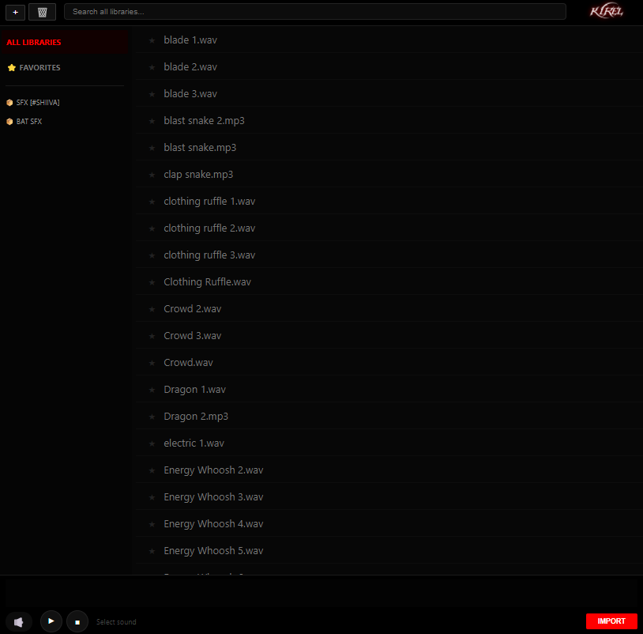
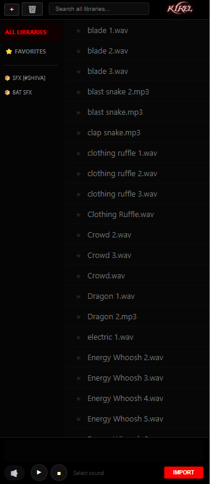

# 🎧 SFX Browser Extension for After Effects

A sleek, lightweight companion for Adobe After Effects that lets you **preview sound effects instantly** without ever leaving AE.

Built for **AMV editors**, motion designers, and creators who need speed, precision, and flow.

---

## ✨ Features

- ⚡ **Instant SFX Preview**
  - Listen to sound effects in real-time directly inside After Effects
  - No importing, no timeline clutter

- 📂 **Direct Library Preview**
  - Just add your SFX library folder
  - Preview all sounds instantly **without leaving AE**

- 🎬 **Made for AMVs**
  - Quickly find the perfect hit, whoosh, or impact

- 🚀 **Workflow Boost**
  - Stay inside After Effects at all times
  - Eliminate guesswork and wasted time

---

## 🖼️ Preview

### 🔹 Preview Mode 1


### 🔹 Preview Mode 2


---

## 📦 Installation
  - Download the Files
  - Run either install_win.bat or install-macos.sh depends on your system and voila
  - Open After Effects and go to ##Windows - Extensions - "ExtensionName##

### ✅ Quick Install

You can **either download the latest release** or clone this repository:

- **Download the latest release** from [GitHub Releases](https://github.com/Kisev2/SFX-Browser-Extension/releases)  

- **Or clone the repository**:
  ```bash
  git clone https://github.com/Kisev2/SFX-Browser-Extension.git
